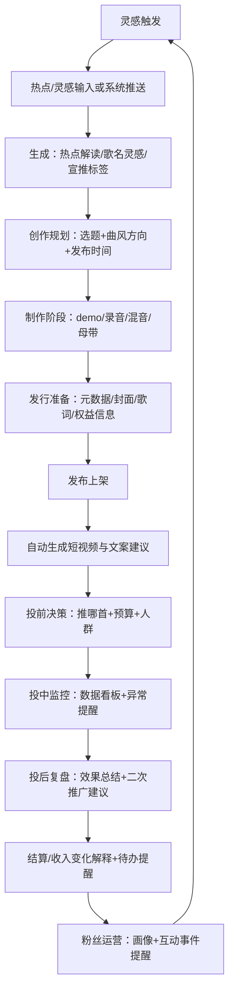
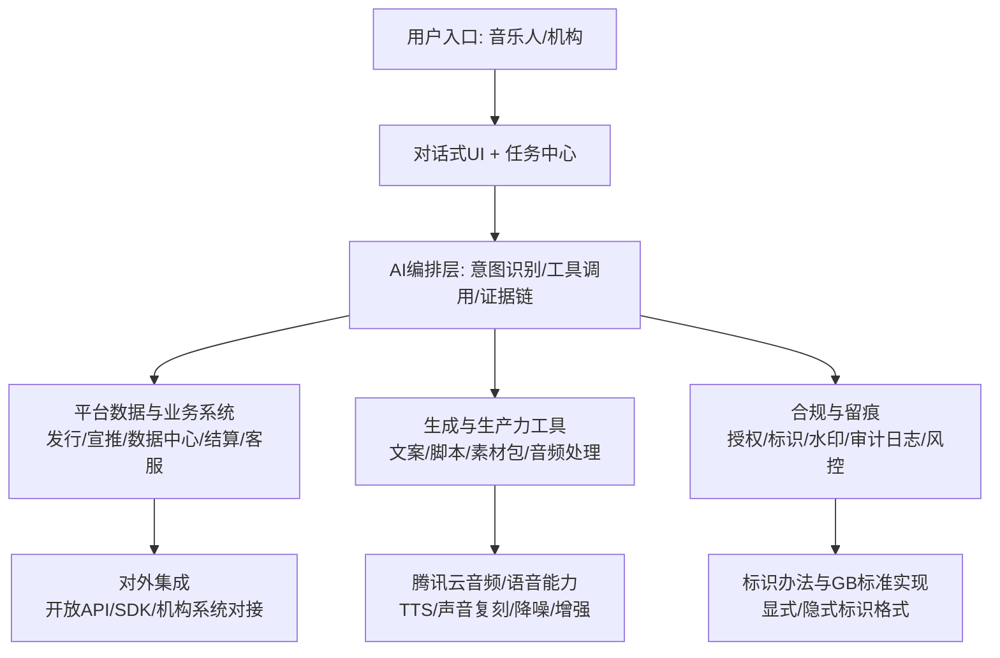

# 基于腾讯音乐人AI助手的音乐人与机构需求脑暴研究报告

## 执行摘要

基于用户提供的《AI音乐助手》需求文档中“一期主要围绕热点创作、宣推建议、问答指南、智能分析四个方向”的定位与功能细节，本报告将“腾讯音乐人AI助手”视为：以平台数据与流程工具为核心、通过对话式交互把“创作—发行—宣推—结算/客服”链路中的关键决策与操作节点串联起来的“工作流Copilot”，而不仅是“文本问答机器人”。fileciteturn0file0

结论上，个体音乐人与机构伙伴的需求虽同源于“作品生命周期管理”，但差异高度集中在三点：  
其一，个体更关心“当下做什么最划算（灵感、质量、效率、曝光、粉丝、收入）”，机构更关心“多人多作品多渠道的可控性（权限、审批、批量、合规、对账）”；其二，个体需要“把建议直接变成素材与动作”，机构需要“把建议变成可审计的流程与报表”；其三，合规风险在机构侧更高频暴露（经纪/厂牌/MCN涉及多人肖像与人声授权、版权链路更复杂、跨系统数据更重）。fileciteturn0file0

产品策略上，短期（可落地）应强化现有四大方向的“闭环能力”：把热点灵感、宣推建议、数据解读、客服指引统一到同一套“任务中心+深度链接+可执行建议”的框架中，并引入更强的可解释性与信任机制（指标口径、证据链、可回溯日志）。fileciteturn0file0turn11view0  
中期建议把能力向“协作与机构化运营”延伸：以多角色权限、项目排期、批量上传与元数据治理、投放与归因、结算与发票为核心工作台。fileciteturn0file0  
长期则围绕“AI生成内容的合规基础设施”建设（显式/隐式标识、授权与留痕、训练数据治理）与“音色/人声等资产化管理”形成平台级壁垒，尤其在2025-09-01起施行的生成合成内容标识规则与强制性国家标准框架下，合规即产品能力。citeturn16search0turn16search1turn16search2

## 研究方法与信息来源

本报告采用“现状能力解构 → 角色目标/场景分层 → 需求/风险映射 → 机会点与路线图”的方法：  
第一，基于用户上传的《AI音乐助手》需求文档提取现有/规划能力、触发机制、指标体系与人群差异点（例如：宣推建议的阶段划分、质量诊断指标、推送频率与退场机制、机构专属待办如“发票待邮寄”等）。fileciteturn0file0  
第二，结合公开的entity["company","腾讯音乐娱乐集团","music entertainment company"]业务与创作者扶持生态描述，建立平台侧“内容—平台—变现”三段式视角（在线音乐、K歌、直播、长音频等多形态）。citeturn11view0turn11view1  
第三，结合entity["company","腾讯云","cloud services"]音频/语音相关产品文档，评估“可工程化落地”的AI能力供给（TTS、声音复刻/克隆、音频降噪/增强等）与其隐私治理要求。citeturn0search1turn4search22turn4search12turn4search10  
第四，基于中国网信与法律主干规则，构建“版权—人格权—个人信息—标识/留痕”的合规风险框架：生成式AI办法、深度合成规定、算法推荐规定、生成合成内容标识办法、以及强制性国家标准GB 45438-2025等。citeturn0search2turn12search0turn12search1turn16search0turn16search1turn16search2  
限制说明：公开渠道对“腾讯音乐人AI助手”的产品级官方文档可检索性有限，因此对“现状能力”的细颗粒度描述以用户提供的需求文档为准，并以公开法规与通用平台能力作为外部校验与扩展边界。fileciteturn0file0

## 现有AI助手能力画像与典型用户旅程

### 现状能力拆解

从需求文档看，一期AI助手的核心不是“生成音乐”，而是围绕音乐人增长与运营的四类场景：  
热点创作（热点解读、歌名灵感、站外宣推标签、热点推送）、宣推建议（投前/投中/投后）、问答指南（活动/功能/客服）、智能分析（画像、跨平台差异、提醒与连接）。fileciteturn0file0

更关键的是它已经具备“工作流化”的雏形：  
一是主动推送机制（例如：每日首次进入触达热点线索、歌曲发布后自动生成短视频并提示标题/话题推荐、推送频率与退场机制等）；二是阶段化决策（新歌冷启/潜力/飙升、老歌低播/成长等，结合完播率、复播率、收藏率、搜播率、杠杆率等指标做诊断与建议）；三是金融/结算叙事（账单变化、结算歌曲数量变化、机构侧发票待办等）。fileciteturn0file0

这类设计与entity["company","腾讯音乐娱乐集团","music entertainment company"]公开材料中“赋能创作和发行”“结合AI工具提供更个性化体验”的方向是同构的：平台强调通过技术与生态为内容创作者网络提升制作效率、扩大机会，并在多产品形态中提供一站式体验。citeturn11view0

### 音乐人创作流程中的“AI触点”示意

下面的流程图不是“理想化全自动作曲”，而是以当前一期能力为核心，把可落地的触点嵌入创作生命周期（灵感→发布→宣推→复盘→变现）。

上述“闭环”节点与文档中的热点创作、宣推建议、智能分析、结算变化与核心待办推送机制是一致的。fileciteturn0file0

## 需求分层与场景矩阵

### 个体音乐人需求

#### 用户目标与关键场景

个体音乐人（独立音乐人、创作人、歌手、制作人）的目标往往被“资源稀缺”约束：时间、预算、协作人脉、宣推资源都有限，因此更需要“用更小成本提升成歌效率与命中率”。与文档里“一期围绕热点创作与宣推决策”的交付方向高度吻合。fileciteturn0file0

将目标拆成可设计的“任务对象”，高频排序通常是：  
创作效率（灵感→成歌）、发行合规（上传/审核/版权）、宣推增长（投放与内容）、变现（直播/打赏/商单/版权）、粉丝运营（互动与复购）。平台侧也在其业务描述中强调“发现—听—唱—看—演出—社交”的多体验形态，意味着音乐人增长并不只发生在“听歌”，还发生在短视频、直播、K歌与演出等场景。citeturn11view0turn11view1

#### 功能需求映射

结合用户要求的功能清单，可将个体侧功能需求分为“数据决策类”“内容生产类”“流程自动化类”三层：

数据决策类（当前一期主战场）  
- 热点与选题：热点解读、推荐话题、歌名灵感、站外宣推标签，目标是让音乐人在站外获取流量入口。fileciteturn0file0  
- 选歌与投放：投前“推什么歌”、投中效果监控、投后总结与二次推广建议；并以完播率、复播率、收藏率、搜播率、杠杆率等作为诊断依据，体现“可执行建议”的方向。fileciteturn0file0  
- 叙事化数据解读：听众画像、跨平台表现差异、播放量变化归因、收入/结算变化归因，把数据中心内容“对话式讲清楚”。fileciteturn0file0  

内容生产类（从“建议”到“素材”的关键跃迁）  
- 短视频/直播内容脚本与包装：文档已出现“发布后自动生成短视频，并提示标题/话题推荐”的思路，说明团队已把“宣推素材生成”作为一类自动化任务。fileciteturn0file0  
- 音频处理提效：文档提到“干声降噪、音质提升”等AI作歌工具组件；对应到可落地的云能力，音频降噪与音视频增强已在腾讯云媒体处理/数据万象等产品中形成API/工作流形态，可作为“制作提效”的工程入口。fileciteturn0file0turn4search12turn4search16  

流程自动化类（减少“到处跳转”成本）  
- 新手/规则/客服：入驻、上传、签约、结算、审核、版权等基础问答，目标是把分散入口与旧链接统一到一个可信的助手入口。fileciteturn0file0  
- 元数据与合规：从“封面、歌词、作者署名、版本信息”到“版权保护证明与维权路径”，助手应承担“校验+引导+留痕”的责任。fileciteturn0file0  

对“AI作曲/编曲/混音/母带/人声合成”类能力的需求，个体侧确实存在，但其落地顺序应被合规与平台策略约束：一方面，平台已有的数据与增长闭环更易形成短期价值；另一方面，涉及人声与风格生成会显著抬升版权与人格权风险，并触发更严格的标识与授权要求。citeturn16search0turn15view0turn12search0

#### 非功能与集成需求

个体侧的“好不好用”往往决定留存：  
易用性上，应减少“聊天—跳转—找入口—再回来”的断裂，优先用“卡片化建议 + 一键执行”实现闭环，这与文档中的“推荐信息外显卡片、功能引导和跳转、推送退场机制”一致。fileciteturn0file0  
集成上，最关键的并非一次性覆盖所有DAW，而是先打通“平台内任务”与“站外发布/投放/内容渠道”的连接：面向短视频平台（entity["company","抖音","short video app"]、entity["company","快手","short video app"]、entity["company","哔哩哔哩","video platform"]、entity["company","小红书","social commerce app"]等）输出可直接复制/导出的脚本、字幕、标签与素材包；面向内容供给侧可用插件/SDK逐步延伸。fileciteturn0file0

### 机构伙伴需求

#### 机构类型差异与共同痛点

机构伙伴（厂牌、经纪公司、版权方、音乐教育机构、直播/短视频MCN等）共同面临“规模化带来的治理成本”：多艺人、多作品、多版本、多渠道、多合同、多账单、多投诉。需求文档中已出现机构专属待办（例如发票相关）、以及“对象：音乐人、机构、词曲作者；流程：入驻、上传、签约、结算、审核”的覆盖范围，说明一开始就把机构当作核心用户之一。fileciteturn0file0

结合entity["company","腾讯音乐娱乐集团","music entertainment company"]公开材料里“我们是音​​乐人和内容拥有者的优选合作伙伴”“倡导版权保护、支持内容合作伙伴”的表述，可推断机构侧的关键指标不仅是播放量，更包括版权治理效率与商业结算效率。citeturn11view0

#### 功能需求与工作台化诉求

机构侧最需要“中台/工作台”而非“单点工具”，优先级通常是：

第一类：权限与协作  
- 多角色权限模型：A&R/经纪/制作/宣发/法务/财务/客服等角色分权；不同操作（发布、改元数据、发起维权、确认账单、开具发票）需要不同授权与审批链。  
- 项目制协作：按“作品/专辑/艺人/企划”建立项目空间，沉淀沟通记录、版本对比、审批记录，满足可追溯。

第二类：批量与质量治理  
- 批量上传、批量元数据校验、重复/冲突检测、版本管理（clean/explicit、伴奏/人声版、剪辑版等）。  
- 版权链路校验与风控：版权方最关心“曲库是否被侵权、相似度/指纹比对、下架与证据链”。

第三类：投放与归因  
- 宣发预算分配、跨渠道效果归因、同曲多版本/多平台的对比复盘。文档中“投前/投中/投后”结构非常适合机构化扩展：把“歌曲级建议”升级为“艺人/厂牌组合级策略”，并加入可导出的周报/月报。fileciteturn0file0

第四类：合约、结算与发票  
- 合同模板库、分账规则引擎、账单变化解释、异常预警（金额波动、结算歌曲变动原因）。文档已明确“结算变化”分析规则，并指出机构侧存在“发票待邮寄”等待办提醒，这应成为机构MVP的核心入口之一。fileciteturn0file0

### 独立音乐人 vs 机构的权限与工作流差异

差异化设计建议用一句话概括：  
独立音乐人需要“把复杂系统藏起来，让行动变简单”；机构需要“把复杂系统结构化，让行动可控、可审计”。

可落到四个具体差异：  
- 账号结构：个人=单主体；机构=多主体（多艺人/多品牌）与多租户隔离。  
- 操作粒度：个人=单首歌/单活动；机构=批量与规则化。  
- 决策逻辑：个人=建议优先；机构=流程优先（建议需挂到流程节点）。  
- 风险承担：个人=轻量提示即可；机构=需要证据链、日志、回滚与追责机制（尤其涉及版权争议与人声/肖像使用）。citeturn16search0turn12search0turn15view0

下图给出机构协作的“可审计流”示意，强调权限、审批与对账。

## 合规与法律风险框架

### 监管与法律主干要求

“音乐AIGC/助手”会同时触达内容安全、版权、人格权与个人信息四条红线，且中国监管已形成较完整的规则组合：

生成式AI服务基本义务  
- 《生成式人工智能服务管理暂行办法》要求尊重知识产权、不得侵害他人肖像权/隐私权/个人信息权益，并提升透明度与生成内容可靠性。citeturn0search2  

深度合成人脸/人声等的特别要求  
- 《互联网信息服务深度合成管理规定》明确适用范围与法律依据，并对深度合成服务提出安全管理与标识等要求；其框架下，人脸、人声等生物识别信息的处理与使用需要满足更严格的合规义务（包括告知与单独同意等典型要求在相关解读与实践中被反复强调）。citeturn12search0turn4search10  

算法推荐与平台治理  
- 《互联网信息服务算法推荐管理规定》要求建立健全用户注册、信息发布审核、数据安全与个人信息保护等制度，并对算法机制机理、模型、数据与应用结果进行定期评估验证。citeturn12search1turn12search17  

AIGC标识与溯源成为“硬性工程要求”  
- 2025-09-01起施行的《人工智能生成合成内容标识办法》明确生成合成内容需要显式与隐式标识，并对服务提供者提出具体标识义务。citeturn16search0turn16search7  
- 与之配套的强制性国家标准GB 45438-2025《网络安全技术 人工智能生成合成内容标识方法》给出可操作的标识方法，是产品落地必须对齐的技术规范。citeturn16search1turn16search2  

人格权与“声音/肖像”边界  
- 《民法典》明确禁止利用信息技术手段伪造等方式侵害他人肖像权，并规定对自然人声音的保护参照适用肖像权保护规则。这对“合成人声、音色复刻、AI翻唱”类功能具有直接约束力。citeturn15view0  

版权与AIGC作品归属不确定性  
- 在AIGC内容版权认定方面，行业报告普遍指出：作品属性、独创性贡献、训练数据合法性与平台责任边界仍是争议焦点，需要在产品侧用“授权、留痕、可解释”降低不确定性。citeturn5search2  

### 风险分级与产品化缓释思路

将用户提出的功能需求按风险等级粗分（用于指导路线图优先级）：

低风险（优先落地）  
- 热点解读、宣推建议、数据分析与复盘、规则问答、元数据自动化校验、投放建议（不生成侵权素材）——主要风险在于“数据准确性与误导”，可用指标口径、证据引用、A/B验证缓释。fileciteturn0file0turn12search1  

中风险（需增加显式标识/来源说明/授权校验）  
- 自动生成短视频脚本/标题/标签、推荐优化、评论洞察与摘要——需防范“虚假信息、诱导营销、隐私泄露”；同时要确保生成内容可标识与可追溯，满足标识办法与标准。fileciteturn0file0turn16search0turn16search2  

高风险（必须“授权+留痕+限制用途+标识”四件套）  
- 音色/人声合成、声音复刻/克隆、拟人化播客配音、AI翻唱、基于特定歌手音色的生成等——涉及人格权（声音/肖像）、个人信息（生物识别/音频信息）、以及潜在著作权/邻接权冲突；必须建立“权利人同意、用途范围、可撤销、审计日志、输出标识”的合规模块。citeturn15view0turn12search0turn16search0turn4search22  

腾讯云侧已有的声音复刻、语音合成等产品文档强调“基于客户上传录音训练、形成定制音色并通过TTS输出”，以及在合规指南中对音频信息处理与删除/管理作出说明，这意味着若引入这类能力，产品必须同步引入“音色资产管理”和“参考音频可控删除”的用户能力。citeturn4search22turn4search10

## 产品机会、差异化方案与路线图

### 集成架构蓝图

集成层面，建议把AI助手设计为“编排层（Orchestrator）”，上接多端入口（PC/小程序/APP/机构工作台/API），下接三类能力：平台数据工具、内容生成工具、合规与留痕工具。

其中对外开放能力可参考开发者平台“通过API/SDK接入音乐能力”的公开定位（作为集成诉求的佐证），但对AI助手而言更重要的是“把内部工具能力产品化为可调用的函数”。citeturn8search0turn11view0

### 面向个体音乐人的发散性功能脑暴表

下表强调“能闭环”的产品概念：每个功能都应能输出可执行动作（发布、投放、生成素材、生成任务、跳转到具体页面完成操作），并给出可量化KPI。

| 功能概念（音乐人） | User story（用户故事） | 预期收益 | 实现复杂度 | 隐私/版权风险 | 建议KPI |
|---|---|---|---|---|---|
| 热点灵感工作台2.0（Prompt+模板） | 作为独立音乐人，我想把热点一键变成可写的“题材+情绪+结构+押韵提示”，从而当天就能开始写歌 | 降低灵感门槛，提升“从灵感到动笔”转化 | 中 | 低 | 热点卡片点击率；prompt复制/使用率；7日内创作启动率 |
| 歌名/副歌Hook生成器（多风格） | 我想快速得到10个可用歌名与副歌Hook文本，方便做A/B测试 | 提升命名效率与传播性 | 中 | 中 | 生成采纳率；A/B点击率提升；发布后搜播率变化 |
| 宣推“推哪首”决策卡（可解释） | 我想知道现在最该推哪首歌，以及依据哪些指标（完播/复播/收藏/搜播/杠杆率等） | 减少决策焦虑，提高投放ROI | 中 | 低 | 推荐采纳率；投放后播放增量/消耗比；二次推广成功率 |
| 投放策略生成（预算分层+人群建议） | 我想输入预算与目标（增粉/播放/上榜），得到可执行的投放计划 | 让新手也能“按步骤投” | 中 | 低 | 投放创建转化率；ROI；新手次月留存 |
| 发布后一键“短视频素材包” | 我想在发布后自动拿到：标题、话题标签、15/30秒脚本、字幕、封面文案 | 把宣推从“不会做”变成“一键拿走” | 中-高 | 中 | 素材下载/导出率；短视频发布量；站外引流占比 |
| 评论与口碑洞察（主题聚类） | 我想知道听众在评论里最喜欢/最吐槽什么，方便下一首优化 | 用用户语言反哺创作与宣推 | 中 | 中 | 洞察查看率；洞察后修改率；收藏/复播改善 |
| 作品“跨平台表现差异”叙事 | 我想知道同一首歌在不同平台表现差异与原因假设 | 识别渠道策略与受众差异 | 中 | 中 | 报告查看率；策略调整率；差异缩小/放大解释满意度 |
| 播放/收入异常提醒（可控频率） | 我想收到关键事件提醒（播放飙升/深夜单曲循环/收入波动）且不过度打扰 | 提升运营敏感度，增强“被看见感” | 中 | 中 | 提醒打开率；退场率；提醒触发后行动率 |
| 创作排期助手（任务化） | 我想把“写词/录音/混音/封面/宣推”变成可勾选清单和日历排期 | 减少遗漏，提升交付率 | 低-中 | 低 | 任务完成率；按期发布率；制作周期缩短 |
| 音频“干声降噪/增强”一键处理 | 我想把家录人声变得更干净可用 | 降低制作门槛，提高demo质量 | 中 | 中 | 处理成功率；处理后留存；用户主观评分 |
| 入驻/审核/版权规则问答与表单预检 | 我想在上传前就知道哪里会被驳回并自动修正 | 减少驳回与客服成本 | 中 | 低 | 驳回率下降；客服工单量下降；上传到上架周期 |
| 版权保护与维权路径导航 | 我想快速拿到“版权登记证书办理渠道/维权路径/证据清单” | 降低维权成本，增强安全感 | 低-中 | 中 | 引导点击率；维权申请转化；侵权处理时长 |

其中“宣推建议、智能分析、问答指南、发布后自动生成短视频提醒”等方向已在现有需求文档中被明确，适合用作音乐人MVP的骨架。fileciteturn0file0  
若引入音频处理能力，可优先从“降噪/增强”这类工程化成熟、可控输出的能力开始（腾讯云已有相对清晰的任务/工作流使用方式），而把“人声合成/音色复刻”留到更后期并配套授权与标识。citeturn4search12turn4search16turn4search22turn16search0

### 面向机构伙伴的发散性功能脑暴表

机构侧每个功能都应回答两个问题：能否规模化（批量/规则/接口）？能否审计（权限/日志/留痕/导出）？

| 功能概念（机构） | User story（用户故事） | 预期收益 | 实现复杂度 | 隐私/版权风险 | 建议KPI |
|---|---|---|---|---|---|
| 机构作品资产工作台（Portfolio） | 作为厂牌运营，我想在一个面板看所有艺人/作品的阶段、风险与增长 | 统一管理视图，减少多系统切换 | 中 | 中 | 日活；作品覆盖率；关键任务完成率 |
| 角色权限与审批流（RBAC+Workflow） | 我想把“改元数据/上架/下架/维权/结算确认”配置成审批链 | 降低误操作与责任不清 | 中-高 | 中 | 审批通过时长；误操作率；审计追溯成功率 |
| 批量上传与元数据治理（QC） | 我想一次上传100首并自动校验作者、版本、封面、歌词、冲突 | 降低人力与驳回率 | 高 | 中-高 | 批量成功率；驳回率下降；人工校验工时下降 |
| 版权链路校验与指纹匹配（Pre-check） | 作为版权方，我想在发布前发现潜在侵权/重复/高相似 | 降低侵权纠纷与下架损失 | 高 | 高 | 侵权投诉率；上架后下架率；命中准确率 |
| 宣发战役管理（跨艺人/跨渠道） | 我想把宣推从“单首歌”升级为“战役”，并自动生成周报/月报 | 提升宣发组织效率 | 中-高 | 中 | 战役配置数量；报表导出率；ROI提升 |
| 投放归因与杠杆率仪表盘 | 我想知道投入带来多少播放/增粉/搜索增长，并可分平台比较 | 提升预算分配质量 | 高 | 中 | 归因覆盖率；决策采纳率；ROI波动收敛 |
| 结算对账机器人（解释+异常） | 我想自动对比本月与上月结算、解释变动、提示异常波动 | 降低财务人工、减少纠纷 | 中 | 中 | 对账工时下降；异常发现提前量；结算纠纷率下降 |
| 发票/合同任务中心（机构专属） | 我想把“发票开具/邮寄/合同归档/回款节点”变成可追踪待办 | 提升财务闭环效率 | 中 | 中 | 发票逾期率；合同归档率；回款周期 |
| MCN内容工厂模式（脚本+素材+排期） | 作为MCN，我想批量生成短视频脚本并排期发布，统一品牌口径 | 提升内容产能与一致性 | 高 | 中-高 | 日均产出；合规拦截率；引流转化 |
| 音色/人声授权资产库（License Vault） | 作为经纪公司，我想管理艺人音色授权范围、期限、用途与撤销 | 降低人格权风险，增强商业化能力 | 高 | 高 | 授权合规模型覆盖率；违规调用次数；撤销响应时长 |
| 侵权线索与维权工单（证据链） | 我想把侵权线索自动聚合并生成证据包与工单流转 | 缩短维权周期 | 中-高 | 高 | 侵权发现时效；工单关闭时长；维权成功率 |
| API/SDK对接与数据导出（BI/ERP） | 我想把作品、投放、结算数据对接到自有BI/ERP | 降低手工整理与数据孤岛 | 中 | 中 | API调用量；数据对账一致性；导出使用率 |

机构侧“结算变化、发票待办”等方向在现有需求文档中已有明确提及，适合把“财务闭环”前置到机构MVP里，而不是作为后置功能。fileciteturn0file0

### 推荐MVP功能集与实施估算

#### 音乐人MVP（建议以“增长闭环”优先）

假设：以“既有一期方向”为主，减少对高风险生成音乐能力的依赖，优先把“建议→动作→复盘”做闭环。fileciteturn0file0  
粗略研发工作量以“人月（person-months）”估算，不含明确预算金额（受团队成本、算力采购与合规投入影响，预算不在本报告中给出具体数值）。

| MVP模块（音乐人） | 核心交付 | 研发工作量（人月） | 关键理由 | 成功标准（示例KPI） |
|---|---|---:|---|---|
| 对话式任务中心+深度链接 | 统一入口、卡片化建议、一键跳转执行 | 6–10 | 解决“到处找入口”，提升留存 | 7日留存；任务完成率；跳转转化率 |
| 热点灵感与宣推标签生成 | 热点推送、解读、歌名灵感、宣推标签 | 4–7 | 一期主方向，价值明确 | 热点点击率；创作启动率 |
| 推歌建议与投放计划（可解释） | 基于指标给出推歌与预算建议 | 6–10 | 把“指标”变“行动” | 推荐采纳率；投放ROI |
| 数据叙事：画像/跨平台差异/播放归因 | 自动生成“可读报告”+证据链 | 6–12 | 建立“信任”，减少误解 | 报告满意度；工单减少 |
| 发布后一键短视频素材包 | 标题/脚本/字幕/话题导出 | 8–14 | 把宣推从建议变素材 | 素材导出率；站外发布量 |
| 规则问答+上传前预检 | 驳回原因预测、修正指引 | 4–8 | 降低驳回与客服成本 | 驳回率下降；上架周期缩短 |

成本假设（不报具体预算）：主要成本来自产品与研发人力、数据管道与观测体系、模型推理与内容安全审核、以及合规（标识、日志、授权、隐私影响评估）工程化投入。citeturn16search0turn12search1turn0search2

#### 机构MVP（建议以“可控运营+财务闭环”优先）

| MVP模块（机构） | 核心交付 | 研发工作量（人月） | 关键理由 | 成功标准（示例KPI） |
|---|---|---:|---|---|
| 机构工作台（Portfolio视图） | 多艺人/多作品阶段、风险、增长面板 | 6–10 | 解决规模化管理入口问题 | DAU；作品覆盖率 |
| 权限与审批流（RBAC+审计） | 高风险操作审批与日志 | 8–14 | 机构最核心差异化 | 误操作率下降；追溯成功率 |
| 批量元数据治理与QC | 批量校验、冲突检测、版本管理 | 10–18 | 人工成本最高的环节之一 | 驳回率下降；工时下降 |
| 结算对账+发票任务中心 | 账单解释、异常提示、发票流转 | 8–14 | 文档已点名机构发票待办 | 对账工时下降；逾期率下降 |
| 战役化宣发与报表导出 | 战役配置、周报月报、ROI | 8–14 | 把投前/投中/投后体系机构化 | 战役数；报表导出率；ROI |

机构MVP与音乐人MVP应共享同一套合规底座，尤其在“生成合成内容标识”已成为明确义务的背景下，内容生成与传播链路必须支持显式/隐式标识与溯源能力。citeturn16search0turn16search2

### 商业模式与变现路径建议

平台侧公开材料显示在线音乐服务与社交娱乐服务并存，并通过订阅、直播等方式变现；行业研究也普遍将订阅、广告与直播视为在线音乐平台的主流货币化路径。citeturn11view0turn5search3  
据此，AI助手的商业化可遵循“价值与风险匹配”的原则：

面向音乐人  
- 订阅制（基础版/专业版）：把“数据叙事+宣推建议+素材包”打包；  
- 按次付费：如高级洞察报告、短视频素材包渲染、音频增强处理；citeturn4search12  
- 增值分成：与站内推广/代投、活动报名、课程培训等联动（以闭环转化为核心）。fileciteturn0file0  

面向机构  
- 席位制（Seat）+模块化：工作台、权限审批、批量治理、对账发票、API对接；  
- 企业服务（SLA/私有化/专属模型）：对大厂牌与版权方提供更高等级的数据隔离与合规审计；  
- 版权/维权增值：侵权监测、证据包、工单协作（需谨慎评估法律服务边界与资质要求）。fileciteturn0file0  

### 优先级建议与实施路线图

短期（0–3个月）  
以“现有一期四方向”为核心，把“建议做成闭环”：热点→选歌→投放→复盘→结算解释→待办提醒；同时统一入口与任务中心，优化推送频率与退场机制（文档已有明确策略）。fileciteturn0file0

中期（3–9个月）  
把能力从“单人助手”扩展为“协作助手”：  
- 音乐人侧：创作排期、素材包流水线、跨渠道发布与复盘；  
- 机构侧：RBAC审批、批量QC、对账发票、战役与报表导出。fileciteturn0file0  

长期（9–18个月）  
聚焦两类平台壁垒：  
- 合规基础设施：对齐标识办法与GB标准，建立“显式/隐式标识、可追溯ID、导出保留标识、传播端核验”的全链路能力；citeturn16search0turn16search2  
- 音色/人声等资产化：在《民法典》声音保护规则与深度合成监管框架下，构建“授权资产库、用途限制、撤销机制、审计日志、输出标识”的产品体系，谨慎引入高风险生成能力（如音色复刻与合成人声），将其从“功能”提升为“可管理资产”。citeturn15view0turn12search0turn4search22