# 腾讯音乐人 AI 助手 — 技术架构方案

> **版本**: v1.0  
> **日期**: 2026-02-20  
> **状态**: 已评审通过  
> **基于**: [deep-research-report.md](../deep-research-report.md)

---

## 一、设计定位

本系统定位为**工作流 Copilot**，核心目标是将「创作 → 发行 → 宣推 → 复盘 → 结算」链路中的关键决策与操作节点，通过对话式交互串联并闭环，而非简单的文本问答机器人。

### 设计原则

| 原则 | 说明 |
|---|---|
| **编排层中心化** | 所有用户意图统一经 AI 编排层调度，避免业务逻辑散落在各端 |
| **工具化 & 可组合** | 每个业务能力封装为标准 Tool/Function，支持 Agent 动态编排 |
| **合规前置** | 合规层作为横切关注点，嵌入到编排和业务层的关键路径中 |
| **多租户隔离** | 个人与机构共享基础设施，通过租户上下文实现数据与权限隔离 |
| **可观测 & 可审计** | 全链路 Trace + 审计日志，支撑合规溯源与运营分析 |

---

## 二、整体分层架构

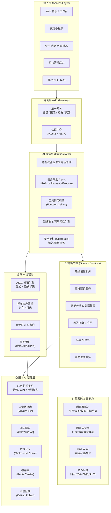

---

## 三、AI 编排层 (Orchestrator)

编排层是系统的「大脑」，负责理解用户意图、规划执行步骤、调用工具、组装结果。

### 3.1 编排流程

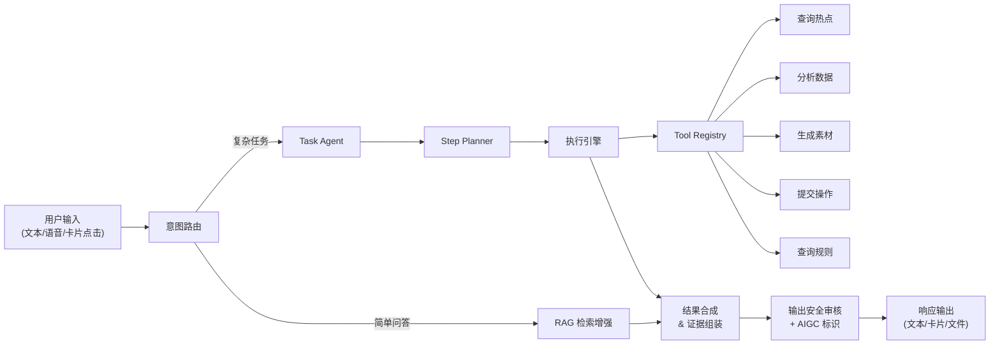

### 3.2 技术选型

| 组件 | 推荐方案 | 理由 |
|---|---|---|
| Agent 框架 | **LangGraph** (LangChain) 或自研 DAG 引擎 | 支持有状态、可回溯的多步任务编排，适合 Plan-and-Execute 模式 |
| LLM 接入 | **混元大模型** (主) + 外部模型 (灰度) | 符合内部生态，混元支持 Function Calling；灰度引入外部模型做 A/B |
| 意图识别 | LLM 分类 + 规则引擎兜底 | 核心场景用规则保底（如结算查询），长尾场景交 LLM |
| 工具注册 | **OpenAPI Schema → Function Definition** 自动映射 | 降低工具接入成本，统一描述格式 |
| 对话管理 | **Redis** 短期记忆 + **数据库** 长期记忆 | 多轮上下文窗口管理 + 用户历史偏好沉淀 |
| 安全护栏 | 腾讯云内容安全 API + 自定义 Prompt Guard | 输入侧过滤违规 Prompt，输出侧检查幻觉/敏感信息 |

### 3.3 Agent 核心逻辑

```python
class MusicianAgent:
    """音乐人 AI 助手 Agent 核心逻辑"""
    
    def __init__(self):
        self.llm = HunYuanLLM(model="hunyuan-pro")
        self.tool_registry = ToolRegistry()
        self.memory = ConversationMemory(
            short_term=RedisStore(),
            long_term=PostgresStore()
        )
        self.guardrails = GuardrailsEngine()
        self.compliance = ComplianceEngine()
    
    async def process(self, user_input: UserInput, context: SessionContext):
        # 1. 输入安全检查
        if not await self.guardrails.check_input(user_input):
            return SafetyResponse("输入包含不安全内容")
        
        # 2. 加载上下文 (用户画像 + 对话历史 + 权限)
        enriched_ctx = await self._enrich_context(user_input, context)
        
        # 3. 意图识别 & 路由
        intent = await self._classify_intent(user_input, enriched_ctx)
        
        # 4. 任务规划 (复杂任务走 Plan-and-Execute)
        if intent.complexity == "complex":
            plan = await self._plan_steps(intent, enriched_ctx)
            result = await self._execute_plan(plan, enriched_ctx)
        else:
            result = await self._direct_answer(intent, enriched_ctx)
        
        # 5. 输出安全检查 + AIGC 标识
        result = await self.guardrails.check_output(result)
        result = await self.compliance.apply_aigc_label(result)
        
        # 6. 组装响应 (文本 + 卡片 + 深度链接)
        return self._render_response(result, enriched_ctx)
```

---

## 四、业务能力层 — 六大核心服务

每个服务暴露为一组标准化的 **Tools**，供编排层按需调用。

### 4.1 热点创作服务 (HotTrend Service)

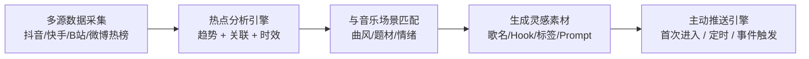

| Tool | 签名 | 说明 |
|---|---|---|
| `get_trending_topics` | `(category, platform, limit) → TopicList` | 获取当前热点 |
| `generate_song_inspiration` | `(topic_id, style, mood) → Inspiration` | 基于热点生成创作灵感 |
| `generate_promo_tags` | `(song_id, platform) → TagList` | 生成站外宣推标签 |

---

### 4.2 宣推建议服务 (Promotion Advisory Service)

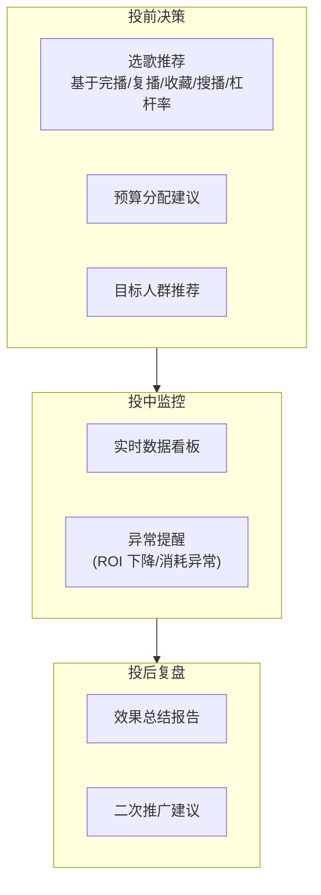

| Tool | 签名 | 说明 |
|---|---|---|
| `recommend_songs_to_promote` | `(artist_id, budget, goal) → Recommendations` | 推歌建议 |
| `generate_promotion_plan` | `(song_id, budget, target) → Plan` | 投放计划 |
| `get_promotion_monitor` | `(campaign_id) → Dashboard` | 投放监控 |
| `generate_promotion_report` | `(campaign_id) → Report` | 投后复盘 |

---

### 4.3 智能分析 & 数据叙事 (Data Narrative Service)

将数据中心的指标转化为自然语言叙事，所有结论附带指标来源与计算口径。

| Tool | 签名 | 说明 |
|---|---|---|
| `get_audience_portrait` | `(entity_id, entity_type) → Portrait` | 听众画像 |
| `analyze_cross_platform` | `(song_id, platforms) → Analysis` | 跨平台分析 |
| `explain_metric_change` | `(metric, entity_id, period) → Explanation` | 指标变化归因 |
| `generate_data_report` | `(entity_id, report_type, period) → Report` | 数据报告 |

---

### 4.4 问答指南 & 客服 (FAQ & Guide Service)

基于 **RAG (检索增强生成)** 架构：

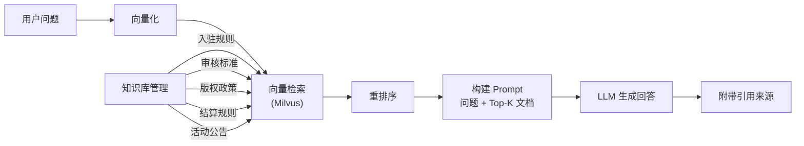

| Tool | 签名 | 说明 |
|---|---|---|
| `search_knowledge` | `(query, category) → Results` | 知识检索 |
| `check_upload_compliance` | `(metadata) → CheckResult` | 上传前预检 |
| `get_review_status` | `(work_id) → Status` | 审核状态 & 驳回原因 |

---

### 4.5 结算 & 财务 (Settlement Service)

| Tool | 签名 | 说明 |
|---|---|---|
| `get_settlement_summary` | `(entity_id, period) → Summary` | 结算概览 |
| `explain_settlement_change` | `(entity_id, period) → Explanation` | 结算变化解释 |
| `get_invoice_tasks` | `(org_id) → TaskList` | 发票待办（机构） |
| `get_song_settlement_detail` | `(song_id, period) → Detail` | 歌曲级结算明细 |

---

### 4.6 素材生成服务 (Content Generation Service)

| Tool | 签名 | 说明 |
|---|---|---|
| `generate_short_video_pack` | `(song_id, platform) → AssetPack` | 短视频素材包 |
| `generate_promo_script` | `(song_id, duration, style) → Script` | 宣推脚本 |
| `process_audio` | `(file_url, task_type) → ProcessedAudio` | 音频处理（降噪/增强） |

---

## 五、数据架构

### 5.1 数据流总览

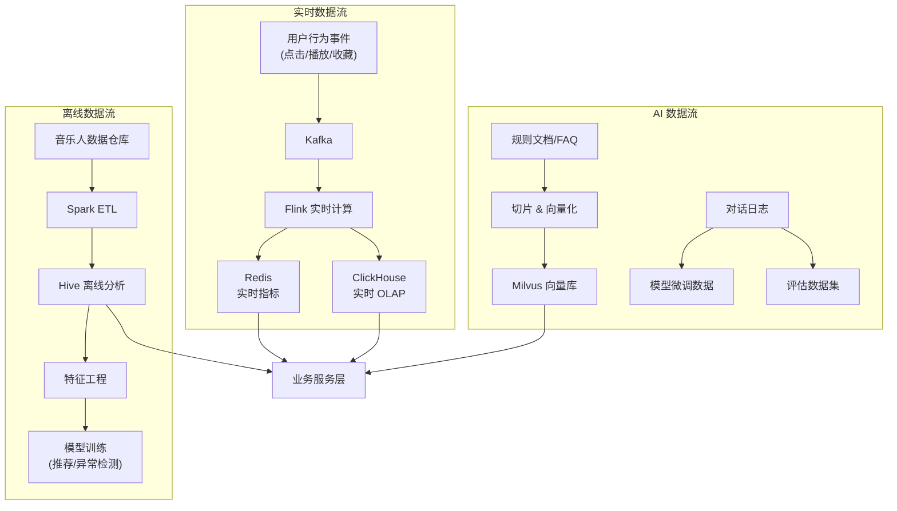

### 5.2 核心数据模型

```sql
-- 对话与任务
CREATE TABLE conversation (
    id          BIGINT PRIMARY KEY,
    user_id     BIGINT NOT NULL,
    tenant_id   BIGINT,          -- 机构租户 ID (个人为 NULL)
    session_id  VARCHAR(64),
    created_at  TIMESTAMP,
    updated_at  TIMESTAMP
);

CREATE TABLE message (
    id              BIGINT PRIMARY KEY,
    conversation_id BIGINT REFERENCES conversation(id),
    role            VARCHAR(16),     -- user / assistant / system / tool
    content         TEXT,
    tool_calls      JSONB,           -- Function Calling 记录
    evidence        JSONB,           -- 证据链 (指标来源/引用)
    aigc_label      JSONB,           -- AIGC 标识元数据
    created_at      TIMESTAMP
);

-- 任务执行记录 (可审计)
CREATE TABLE task_execution (
    id              BIGINT PRIMARY KEY,
    conversation_id BIGINT,
    task_type       VARCHAR(64),
    tool_name       VARCHAR(128),
    input_params    JSONB,
    output_result   JSONB,
    status          VARCHAR(16),     -- pending / running / success / failed
    operator_id     BIGINT,          -- 操作人 (机构审计用)
    approved_by     BIGINT,          -- 审批人 (机构审计用)
    trace_id        VARCHAR(64),     -- 全链路追踪 ID
    created_at      TIMESTAMP,
    duration_ms     INT
);

-- AIGC 内容标识溯源
CREATE TABLE aigc_content_registry (
    id              BIGINT PRIMARY KEY,
    content_hash    VARCHAR(128),
    content_type    VARCHAR(32),     -- text / image / audio / video
    generation_model VARCHAR(128),
    prompt_hash     VARCHAR(128),
    explicit_label  TEXT,            -- 显式标识文本
    implicit_label  BYTEA,           -- 隐式水印数据
    created_by      BIGINT,
    created_at      TIMESTAMP
);
```

---

## 六、合规基础设施

基于研报中识别的法规要求（生成式 AI 办法、深度合成规定、标识办法、GB 45438-2025），合规模块覆盖以下能力：

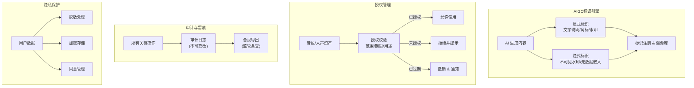

### 风险分级合规策略

| 风险等级 | 对应功能 | 合规策略 |
|---|---|---|
| **低风险** | 热点解读、数据分析、规则问答 | 指标口径标注 + 证据引用 + 幻觉检测 |
| **中风险** | 文案/脚本生成、标签推荐 | AIGC 显式标识 + 隐式水印 + 内容安全审核 |
| **高风险** | 音色复刻、人声合成、AI 翻唱 | 授权四件套（同意 + 留痕 + 限制用途 + 标识） + DPIA |

---

## 七、多租户与权限体系

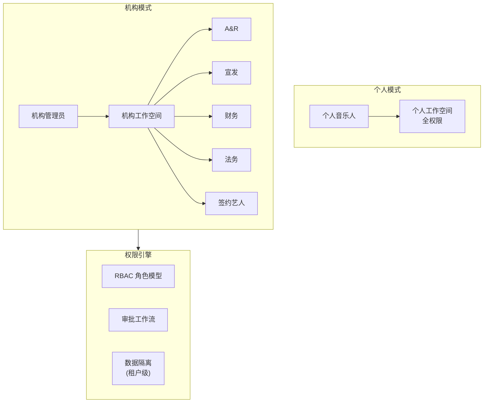

### RBAC 权限矩阵

| 操作 | A&R | 宣发 | 财务 | 法务 | 签约艺人 |
|---|:---:|:---:|:---:|:---:|:---:|
| 查看作品数据 | ✅ | ✅ | ❌ | ✅ | 仅自己 |
| 发起宣推 | ✅ | ✅ | ❌ | ❌ | 需审批 |
| 查看结算明细 | ❌ | ❌ | ✅ | ✅ | 仅自己 |
| 修改元数据 | ✅ | ❌ | ❌ | ❌ | 需审批 |
| 发起维权 | ❌ | ❌ | ❌ | ✅ | 需审批 |
| 操作发票 | ❌ | ❌ | ✅ | ❌ | ❌ |

---

## 八、技术选型总览

| 层级 | 技术组件 | 推荐选型 | 备选方案 |
|---|---|---|---|
| **接入层** | Web 框架 | React + Next.js | Vue 3 + Nuxt |
| **接入层** | 移动端 | WebView + JSBridge | Flutter 嵌入 |
| **网关层** | API 网关 | 腾讯云 API Gateway / Kong | Nginx + Lua |
| **网关层** | 认证 | OAuth 2.0 + JWT | 腾讯云 CAM |
| **编排层** | Agent 框架 | LangGraph + 自研扩展 | AutoGen / 纯自研 |
| **编排层** | LLM | 混元大模型 | DeepSeek / GPT-4o |
| **编排层** | 向量库 | Milvus (腾讯云版) | Zilliz / Qdrant |
| **编排层** | Embedding | BGE-M3 / 混元 Embedding | text-embedding-3 |
| **业务层** | 后端语言 | Java 21 (Spring Boot 3) + Python (AI) | Go (高性能服务) |
| **业务层** | RPC | Dubbo 3 / gRPC | HTTP REST |
| **数据层** | 关系数据库 | PostgreSQL / MySQL 8 | TiDB |
| **数据层** | OLAP | ClickHouse | StarRocks |
| **数据层** | 缓存 | Redis Cluster | — |
| **数据层** | 消息队列 | Kafka | Pulsar / RocketMQ |
| **数据层** | 实时计算 | Flink | — |
| **合规层** | 内容安全 | 腾讯云天御 | 自建模型 |
| **合规层** | AIGC 水印 | 自研隐式水印 + 显式角标 | — |
| **运维层** | 容器编排 | Kubernetes (TKE) | — |
| **运维层** | 可观测 | Prometheus + Grafana + Jaeger | 腾讯云 APM |
| **运维层** | 日志 | ELK / Loki | 腾讯云 CLS |

---

## 九、关键交互流程

### 9.1 音乐人查询「我该推哪首歌」

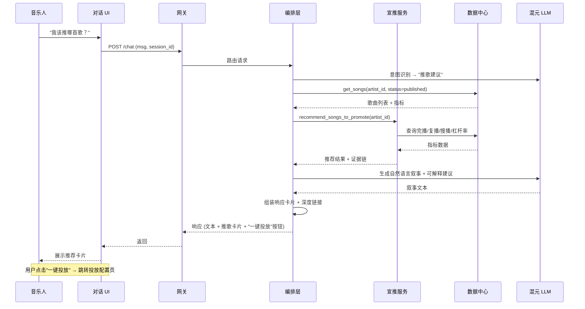

### 9.2 机构查询「本月结算为什么少了」

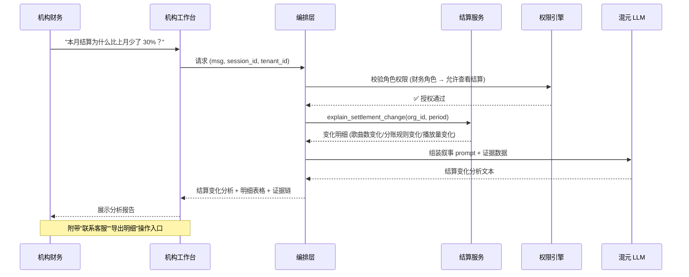

---

## 十、非功能需求

### 性能指标

| 指标 | 目标值 |
|---|---|
| 简单问答响应 (P95) | ≤ 2s（首 Token ≤ 500ms） |
| 复杂任务响应 (P95) | ≤ 8s（含多步工具调用） |
| 系统可用性 | ≥ 99.9% |
| 并发对话支持 | ≥ 10,000 |
| LLM 推理 QPS | 按需弹性扩缩 (GPU 集群) |

### 可观测体系

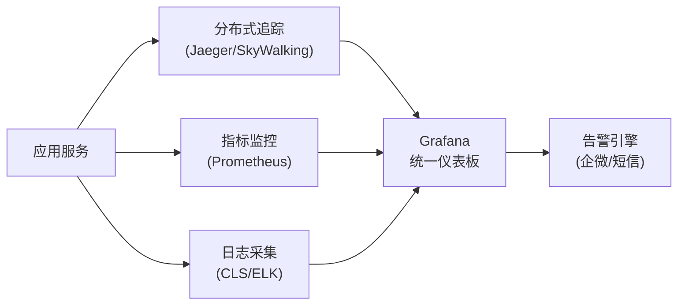

### 灰度发布策略

- **按用户灰度**：内测 → 白名单 → 1% → 10% → 50% → 全量
- **按功能灰度**：Feature Flag 控制，独立开关每个 Tool
- **模型灰度**：A/B Testing 对比不同 LLM 版本的回答质量

---

## 十一、分期实施路线图

### Phase 1：MVP（0 - 3 个月）— 对话闭环

| 里程碑 | 交付物 | 关键工作 |
|---|---|---|
| M1 (第 1 月) | 基础架构搭建 | 编排层骨架、网关、鉴权、对话管理、工具注册机制 |
| M2 (第 2 月) | 核心 Tools 接入 | 热点创作、宣推建议、数据叙事、FAQ 问答四组 Tools |
| M3 (第 3 月) | 闭环体验 + 灰度 | 卡片化 UI、深度链接、推送机制、安全护栏、内测灰度 |

### Phase 2：增强（3 - 6 个月）— 能力扩展

| 里程碑 | 交付物 | 关键工作 |
|---|---|---|
| M4 | 素材生成 | 短视频素材包、宣推脚本生成、AIGC 标识接入 |
| M5 | 结算分析 | 结算变化归因、收入异常检测、发票待办（机构） |
| M6 | 机构基础 | 多租户隔离、RBAC 权限、基础审批流 |

### Phase 3：机构化（6 - 12 个月）— 工作台

| 里程碑 | 交付物 | 关键工作 |
|---|---|---|
| M7-M8 | 机构工作台 | Portfolio 视图、批量元数据治理、战役化宣发 |
| M9-M10 | 合规基建 | GB 45438 全链路标识、授权资产库、审计导出 |
| M11-M12 | 开放平台 | API/SDK 对外开放、机构系统对接、数据导出 |

### Phase 4：壁垒（12 - 18 个月）— 平台级能力

| 关键方向 | 说明 |
|---|---|
| 音频 AI 能力 | 干声降噪/增强、音色资产管理（需合规四件套） |
| 跨平台联动 | 站外发布助手、跨平台归因增强 |
| 智能化升级 | 个性化模型微调、创作排期 Agent、评论洞察 |

---

## 十二、风险与缓释

| 风险 | 影响 | 缓释措施 |
|---|---|---|
| LLM 幻觉导致错误建议 | 用户信任下降 | 证据链机制 + 人工审核兜底 + 置信度标注 |
| 合规政策变化 | 功能下架/罚款 | 合规模块抽象化 + 定期法规扫描 + 预留标识接口 |
| 内部系统 API 不稳定 | 工具调用失败 | 熔断/降级/缓存 + 优雅错误提示 |
| 模型推理成本高 | 预算超支 | 分级调用（轻量问题用小模型）+ 缓存热点回答 |
| 机构多租户数据泄露 | 安全事故 | 租户级隔离 + 行级权限 + 渗透测试 |
